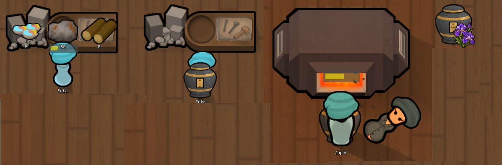
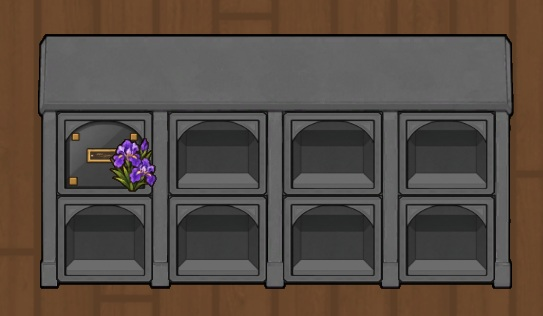
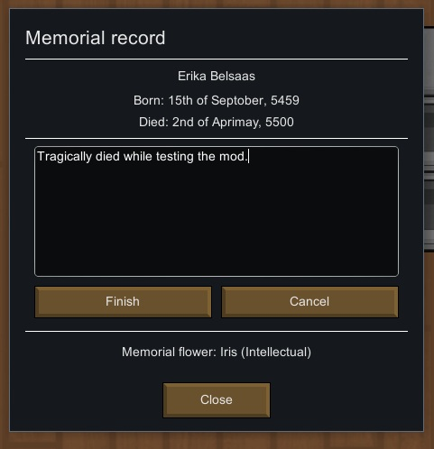

# Columbarium for RimWorld 1.6

## 1. Introduction

- This mod adds columbaria and memorial urns. You can cremate a corpse into an urn and store the urn in a columbarium.

- Standard columbaria hold one urn per tile, while compact columbaria hold four. They let you remember your colonists even when space is tight.

- The flower on an urn reflects the deceased colonist's strongest skill. For example, a colonist whose strongest skill was Melee receives a gladiolus.

- Each urn records a name and dates, and you can engrave an epitaph.

## 2. How to use

1. Make an empty urn at a sculptor's table.

2. Cremate a corpse into the urn at an electric crematorium. You can also use a campfire, but it takes much longer and requires a lot of wood.

3. Place the urn in a columbarium.

4. Engrave an epitaph. Once engraved, it cannot be changed.

## 3. Variants

- Columbaria come in versions that hold 8 or 32 urns.

- Standard columbaria hold one urn per tile; compact columbaria hold four. The compact versions are small, so their details may be hard to see without a zoom mod.

- Their specifications are otherwise nearly identical. The standard-size versions provide a small Beauty bonus.

## 4. Notes

- AI tools were used during development.

- This mod has passed short-term testing. Long-term save testing and compatibility testing with other mods are ongoing. It has also been tested alongside more than 200 mods, but please report any bugs you find.

- In terms of balance, a columbarium costs twice as much as a vanilla sarcophagus, but it holds far more people and uses resources more efficiently. Then again, should remembrance really be measured by efficiency?
